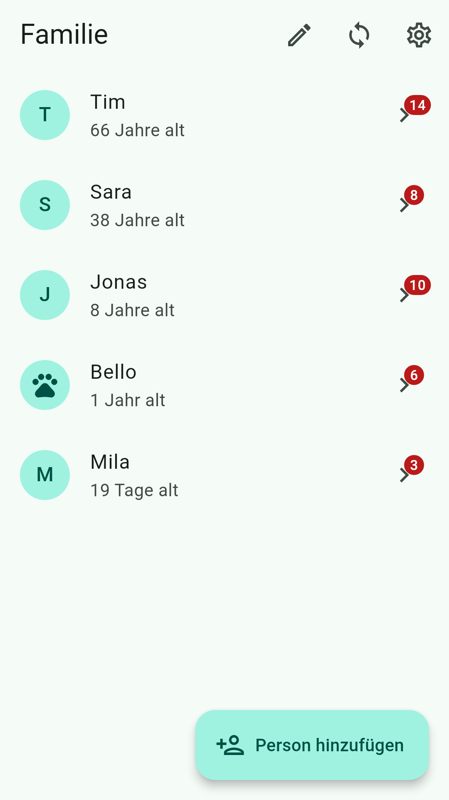
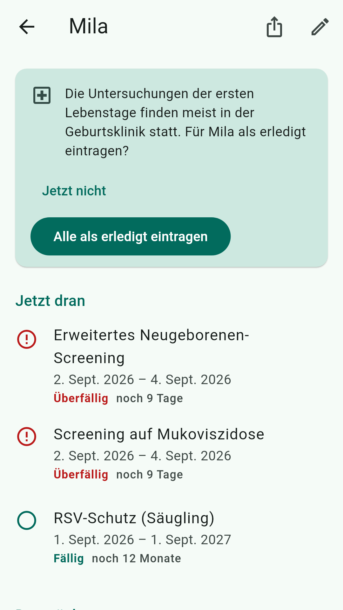
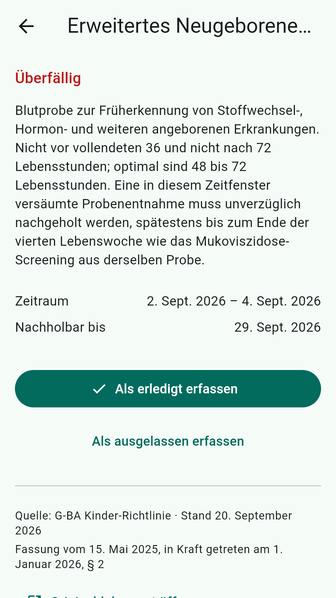

# Vorsorgeheft

Vorsorgetermine für die ganze Familie: U-Untersuchungen, STIKO-Impfungen,
Zahnvorsorge und Erwachsenen-Früherkennung, berechnet aus dem Geburtsdatum.
Alles bleibt auf dem Telefon, ohne Konto und ohne Server.

Die Daten bleiben auf dem Telefon: Die App ist vom Cloud-Backup des
Betriebssystems ausgenommen, und der Abgleich läuft direkt von Telefon zu
Telefon.

- [Datenschutzerklärung](datenschutz) · [Privacy policy](privacy)
- [Quellcode und Downloads auf GitHub](https://github.com/praetorianer777/vorsorgeheft)
- [Problem melden](https://github.com/praetorianer777/vorsorgeheft/issues/new)

Die App ersetzt keine ärztliche Beratung. Die Angaben beruhen auf den in der App
genannten Richtlinien mit dem dort angegebenen Stand, sind aber ohne Gewähr.
